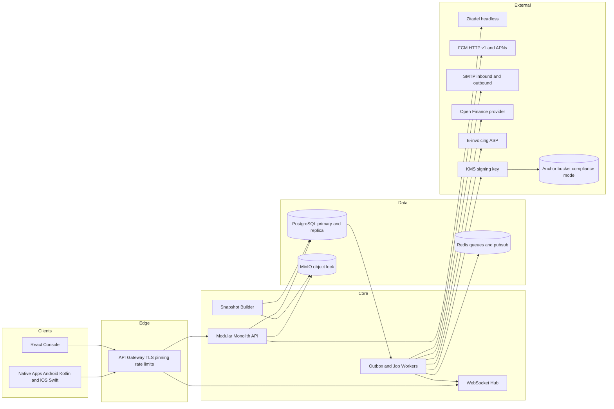
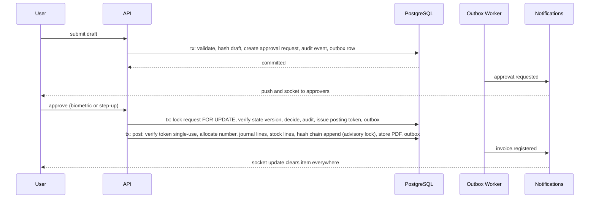

# 02 Architecture

## System shape

## Technology choices

Decided 2026-09-25: Go backend, two native mobile apps, React console, PostgreSQL. Alternatives considered are recorded in the ADRs.

Backend (Go):

- Language and layout: Go 1.26 or later, single module, modular monolith with one binary per role (api, worker, scheduler) built from the same code. Module boundaries enforced by package layout (`internal/<module>`) and a dependency rule checked in CI (go-arch-lint or depguard).
- HTTP: standard library `net/http` with the 1.22+ mux, or chi (MIT) for middleware ergonomics; OpenAPI 3.1 as the source of truth with oapi-codegen (Apache-2.0) generating server interfaces and client types; request validation from the schema.
- Database access: pgx v5 (MIT) with sqlc (MIT) for typed queries; migrations with goose or Atlas (Apache-2.0) run as the owner role; RLS session variables set per request in a transaction-scoped middleware.
- Jobs and outbox: River (MPL-2.0, file-level copyleft, acceptable unmodified) for transactional enqueue in the same PostgreSQL transaction as the business write; this is the outbox. Redis used only for WebSocket fan-out pub/sub and DPoP JTI replay cache.
- Identity: Zitadel v3+ run headless as a separate, unmodified service (core is AGPL-3.0; protos, SDKs, Helm chart are Apache-2.0). Zitadel owns users, organisations, factors (password, TOTP, passkeys via WebAuthn), lockout policy, and the Session API v2 that our API calls over gRPC using clients generated from the Apache-2.0 protos. Our API is the token issuer for its own audience: after Zitadel confirms the session factors, the API mints a short access token (ES256 via lestrrat-go/jwx, MIT) carrying `cnf.jkt` for the enrolled device key, and a device-bound rotating refresh token; DPoP proofs are verified at our gateway with ConductorOne/dpop or AxisCommunications/go-dpop. Step-up: the API asks Zitadel to re-check a factor on the session and then issues a two-minute single-use step-up token. The console uses the same flow through a custom login page that proxies OIDC to Zitadel; Zitadel's hosted login is available unmodified as a fallback.
- Real time: coder/websocket (ISC) hub in the api binary, fed by River jobs through Redis pub/sub, per-user subscriptions with acks.
- Push: firebase-admin-go messaging for FCM HTTP v1 (Apache-2.0); sideshow/apns2 for APNs token auth (MIT); data-only messages; payload validated against the event JSON Schema.
- Email: wneessen/go-mail for outbound SMTP with DKIM at the relay (MIT); emersion/go-imap for the inbound mailbox (MIT).
- Money and numbers: shopspring/decimal (MIT) everywhere money or quantity appears; no floats in the domain.
- Documents: HTML templates with html/template rendered to PDF by headless Chromium through chromedp (MIT) in the worker; Excel with excelize (BSD-3); CSV and XML from the standard library; PINT AE UBL XML via encoding/xml against the FTA schema.
- Storage and keys: minio-go (Apache-2.0) or aws-sdk-go-v2 (Apache-2.0) for object lock buckets; KMS via cloud SDK or HashiCorp Vault Transit (vault client is MPL-2.0).
- Hashing: crypto/sha256 with a canonical JSON encoder (deterministic key order, decimal strings) implemented in-house and tested against fixtures shared with the clients.
- Observability: OpenTelemetry Go SDK (Apache-2.0), slog structured logs, pgaudit shipped to the same sink.
- Testing: standard testing with testcontainers-go (MIT) for PostgreSQL, Redis, MinIO, and Keycloak; contract tests generated from OpenAPI; property tests for the ledger and availability invariants.

Database and storage:

- PostgreSQL 16 or later (PostgreSQL Licence). Row-level security, BEFORE triggers, event triggers, advisory locks, deferred constraint triggers for debit-equals-credit. In phase 1 reports and snapshots read the single primary through a low-priority connection pool and run in the nightly window where heavy; a read replica is a later addition that needs no application change.
- Redis 7 or Valkey (BSD) for pub/sub, JTI replay cache, and rate-limit counters only.
- MinIO (AGPL server, run unmodified as a separate service; S3 API so a managed S3 with object lock is a drop-in) with object lock compliance mode for attachments, rendered PDFs, snapshots, backups, and chain anchors.

Mobile (two native apps):

- Android: Kotlin, Jetpack Compose, Retrofit or Ktor with generated OpenAPI client, Room with SQLCipher for the encrypted offline store, Android Keystore (StrongBox where available) for device keys and credentials, WorkManager for sync, FCM.
- iOS: Swift, SwiftUI, URLSession with generated OpenAPI client, GRDB or Core Data with SQLCipher for the offline store, Keychain and Secure Enclave for device keys and credentials, BGTaskScheduler for sync, APNs with UNNotification categories for actions.
- Shared across both: the design-token package, the OpenAPI-generated models, the event JSON Schema, the canonical-JSON fixtures for hash display, and a written interaction spec so the two apps behave identically. A shared test matrix in `08` runs against both.

Console:

- React 19 with TypeScript, Vite, TanStack Query and Table, React Router, Radix primitives styled with the shared tokens, cmdk for the command palette, i18next with RTL. MIT throughout.

Design system:

- Figma tokens exported to a token package consumed by Compose, SwiftUI, and React.

Integrations:

- Open Finance via Lean Technologies for bank feeds; MT940 and CSV parsers for uploads; e-invoicing ASP over HTTPS for PINT AE in 2027.

Infrastructure (decided 2026-09-25: on-premises Linux NUCs, Mac for development only):

- Target: phase 1 production runs on one ASUS x86_64 Linux NUC on the company premises behind its firewall. Development runs on one Apple Silicon Mac. There is no orchestrator and no second node in phase 1.
- Images: every image is multi-arch, `linux/amd64` for the NUCs and `linux/arm64` for the Mac dev stack. Go services are static binaries in distroless images built with `docker buildx` and pushed for both architectures by CI. Third-party images (PostgreSQL, Redis or Valkey, MinIO, Zitadel, Caddy, Mailpit, chromedp headless-shell) are pinned to multi-arch tags.
- Orchestration: one `docker-compose.yml` drives both dev and NUC, with profiles and override files for secrets, hostnames, resource limits, and off-site bucket endpoints. On the NUC, compose runs under a systemd unit with restart policies and health checks. See ADR-16.
- Ingress: Caddy (Apache-2.0) as the reverse proxy on the NUC with automatic TLS on a public hostname when an inbound port is allowed; otherwise Cloudflare Tunnel or Tailscale Funnel with no inbound port. Everything else (push, email, bank feed, e-invoicing, anchors, backups, telemetry) is outbound only.
- Off-site: chain anchors and backups also go to a cloud S3-compatible bucket with object lock in compliance mode; the anchor signing key lives in a cloud KMS or a Vault instance on a separate host; telemetry ships to an off-prem observability sink. An on-prem-only bucket does not satisfy the tamper-evidence goal.
- Delivery: GitHub Actions with licence scan (go-licenses), SBOM (syft), dependency and container scanning, multi-arch build and push; deployment to the NUC by pulling pinned digests and running `docker compose up -d` with expand-contract migrations executed by the migrator role before the new API starts; rollback is re-pinning the previous digests.
- Secrets: on the NUC a local Vault agent or age-encrypted env files unlocked at boot from an operator-held key; never plaintext in the repo.

Licence rule: every dependency is Apache-2.0, MIT, BSD, PostgreSQL, MPL-2.0 (file-level copyleft only), or equivalent. No GPL, AGPL, or SSPL in the runtime. A licence scan runs in CI and fails on violation. Counsel confirms the list before the first release.

## Architecture decision records

- ADR-01 Build the domain; do not fork an ERP. ERPNext is GPL-3.0 and a proprietary product cannot include it. Apache OFBiz is Apache-2.0 but would impose its Java and UI stack. Own the accounting and stock domain, borrow designs, not code.
- ADR-02 Modular monolith before services. One deployable with strict module boundaries. Split only when a module has an independent scaling or release need; the outbox and event contracts make that split possible later.
- ADR-03 PostgreSQL is the ledger. Debits equal credits is a database constraint. Immutability is enforced by grants and triggers, not by application discipline alone.
- ADR-04 Outbox for every side effect. Business write and outbox row commit together. Notifications, snapshots, emails, and integrations consume the outbox. At-least-once with idempotency keys.
- ADR-05 Approvals are a state machine with a posting token. No global flags. Transitions take a row lock and bump a state version.
- ADR-06 Hash chain plus external anchor. Tamper-evidence against the database operator requires a chain head stored where the operator cannot write. Compliance-mode object lock plus a KMS signature plus a daily email.
- ADR-07 Data-only push. The app always builds the notification so deep links, severity channels, and actions are consistent, and so a stale push body is never shown as fact.
- ADR-08 Snapshot analytics. Stakeholder figures are precomputed, versioned, and served as documents; the phone renders and exports from the same snapshot; both carry `as_of_date` and `computed_at`.
- ADR-09 Contract first. `04-api-contracts.md` changes before code; clients and server generate types from the same schema (OpenAPI plus JSON Schema for events).
- ADR-10 Two native mobile apps. Kotlin and Compose on Android, Swift and SwiftUI on iOS, sharing generated API models, the token package, the event schema, and one written interaction spec. Chosen over Kotlin Multiplatform and Flutter for platform fidelity in security primitives (Keystore and StrongBox, Secure Enclave), notification actions, background sync, and accessibility. Cost is roughly double the mobile effort; mitigated by shared contracts and a shared test matrix.
- ADR-13 Go for the backend. Chosen over TypeScript with NestJS and Kotlin with Spring Boot for a small static runtime, predictable concurrency for the outbox and socket hub, and strong typing with generated code from OpenAPI and SQL. Every required capability has a maintained permissive library: River for transactional jobs, go-oidc and dpop for identity, firebase-admin-go and apns2 for push, chromedp for PDF, excelize for Excel, pgx and sqlc for the database. Trade-off: fewer batteries than a full framework, so the platform track owns a thin internal kit for envelopes, idempotency, If-Match, RLS session scoping, and audit emission that every module uses.
- ADR-15 Zitadel headless instead of Keycloak. Chosen because it is Go, single binary on PostgreSQL, and its Session API is designed for a custom login flow, which is what native apps and a keyboard-first console want. Trade-offs accepted: the core is AGPL-3.0 from v3, so it is run unmodified as a separate service and never embedded or patched (documented for counsel, same posture as MinIO); Zitadel does not implement DPoP, so device binding and token issuance for the ERP audience live in our API, with Zitadel reduced to user store and factor verification. This keeps IdP swap cost low: Keycloak or a managed provider could replace Zitadel behind the same internal interface.
- ADR-14 River as the outbox. Jobs are enqueued in the same PostgreSQL transaction as the business write, so the outbox guarantee holds without a separate table or relay. River is MPL-2.0; it is used unmodified, which imposes no obligation on the product's own code. If licence posture changes, the fallback is an in-house outbox table with a poller.
- ADR-16 Single on-premises NUC for phase 1. Production is one ASUS x86_64 Linux NUC at the company, running the full stack (PostgreSQL, Redis or Valkey, MinIO, Zitadel, API, workers, headless Chromium, Caddy) with docker compose under systemd. No orchestrator, no second node, no replication in phase 1. A single NUC is a single point of failure; that is accepted and mitigated by a UPS, a spare NUC on the shelf or a documented procurement lead time, off-site backups with continuous WAL archiving, and a restore runbook rehearsed on a second machine. Off-site anchoring and off-site backups are not optional in this model; they are what make a single-node deployment auditable. Compose is chosen over Swarm, Nomad, and k3s because it is the same file the developer runs on the Mac and it carries no operational weight beyond systemd. The architecture supports growth without rework because all state lives in PostgreSQL and MinIO: a second node later means PostgreSQL streaming replication plus a MinIO site replica plus a cold copy of the compose stack, none of which changes application code. When to add a second node (a note, not a task): when the company decides that losing a business day to a hardware failure is unacceptable, or when the database grows past the size where restore from the off-site bucket onto a replacement NUC no longer fits in one business day, or when management asks for an availability target rather than best effort. At that point the choice is a warm standby with streaming replication and a scripted promotion; k3s is not needed until the company has more than one site or needs failover with no operator action.
- ADR-11 Posting rules are configuration. Document to account mapping lives in versioned, approved rules, not code, so an Accountant can change an account without a release.
- ADR-12 Business-hours clocks. All SLA windows count working hours against the company calendar.

## Module boundaries

Each module owns its tables, exposes a service interface, and emits events. Cross-module reads go through the interface or a read model; no cross-module table joins in application code except in the reporting module, which reads replicas.

| Module | Owns | Emits |
| --- | --- | --- |
| identity | users, roles, devices, sessions, SoD matrix, access reviews | user.disabled, role.changed, device.registered |
| approvals | requests, matrix, delegations, decisions, posting tokens | approval.requested, decided, posted |
| audit | audit events, chain heads, anchors, verification runs | chain.verified, chain.broken |
| ledger | accounts, dimensions, periods, journals, postings, posting rules | journal.posted, period.closed |
| masters | customers, vendors, SKUs, BOMs, prices, agreements, tax codes, templates | master.changed (versioned) |
| sales | orders, reservations, invoices, gate passes, delivery notes, credit notes, proof of delivery | order.created, invoice.registered, delivery.confirmed |
| receivables | receipts, PDCs, allocations, dunning, statements | receipt.posted, pdc.bounced |
| purchase | requisitions, quotes, LPOs, receipts, supplier invoices, debit notes, payment runs | lpo.registered, invoice.matched, payment.released |
| stock | stock ledger, counts, adjustments, write-offs, production entries | stock.moved, count.approved |
| bank | statements, feeds, reconciliation, petty cash, cheque register, facilities, forecast | statement.imported, forecast.updated |
| assets | register, depreciation, disposals | depreciation.posted |
| corrections | correction requests and their generated documents | correction.posted |
| notifications | outbox consumers, preferences, rules, device tokens, logs | notification.sent, failed |
| analytics | snapshots, ratios, management pack, saved views, schedules | snapshot.published |
| journeys | journey definitions, instances, steps | journey.step.completed |
| compliance | Article 59 validation, FAF, VAT return file, PINT AE model, ASP connector, corporate tax | einvoice.transmitted, return.filed |
| admin | settings, alert rules, print formats, holiday calendar, numbering | config.changed |

## Data flow for a governed document

## Non-functional targets

- Availability: best effort on a single node in phase 1; no numeric target. Planned maintenance in a nightly window; unplanned downtime bounded by the restore runbook below. A numeric target is set when a second node is added.
- Latency: p95 under 300 ms for list and detail endpoints; under 800 ms for registration transactions; socket event delivery under one second.
- Throughput: 50 concurrent console users, 200 mobile devices, 5,000 documents per day, headroom 10x.
- Data: 7-year retention online; attachments 1 TB first year.
- Recovery point: 15 minutes if continuous WAL archiving to the off-site bucket is delivered in Phase 1 (task P1.15 includes it, so this is the target); if WAL archiving slips, the honest number is 24 hours from nightly backups, and the status page must say which one is in force.
- Recovery time: restore onto a replacement NUC from the off-site bucket, target within one business day, using a runbook rehearsed on a second machine (the Mac or a borrowed NUC) before go-live and quarterly after. Restore is complete only when the manifest verifies, ledger totals re-derive, and the chain verifies against the latest off-site anchor.
- Single point of failure, stated plainly: one NUC. Mitigations: UPS with clean shutdown, a spare NUC on the shelf or a written procurement lead time accepted by management, off-site backups and WAL, and the rehearsed restore.
- Sizing (one NUC, everything co-located, for 50 console users, 200 devices, 5,000 documents per day, with headroom): 8 or more performance cores (Intel Core i7 or Core Ultra 7 class), 64 GB RAM preferred, 32 GB minimum, 2 TB NVMe for the OS, PostgreSQL, Redis, and Zitadel, and a second local disk (2 to 4 TB NVMe or SATA SSD, or a USB-attached NAS) for MinIO data and local backup staging before off-site upload, 2.5 GbE or better. Expected steady state: PostgreSQL 8 GB shared buffers plus OS cache, Redis under 1 GB, MinIO 2 GB, Zitadel 1 GB, API and workers 2 GB, headless Chromium 1 to 2 GB under report load. UPS sized for a clean shutdown of the NUC, the switch, and the router.
- Security: OWASP ASVS level 2 for the API, MASVS level 2 for mobile; annual external penetration test.
- Accessibility: WCAG 2.2 AA on console and mobile.
- Localisation: English and Arabic, RTL, AED formatting with fils, Hijri date display optional.

## Environments and release

- Local (Mac, arm64): the same `docker-compose.yml` as production with the `dev` profile: PostgreSQL, Redis or Valkey, MinIO, Zitadel, Caddy (self-signed), Mailpit, headless-shell, plus a push sink that logs FCM and APNs payloads instead of sending. Differs from the NUC only in secrets, hostnames, resource limits, and off-site bucket endpoints (dev points anchors and backups at a second local MinIO bucket named `offsite-sim`).
- Restore rehearsal machine: the Mac or a borrowed NUC running the `prod` profile against a copy of the off-site bucket; used to prove the restore runbook before go-live and quarterly. No permanent staging environment in phase 1; mobile beta runs against the production NUC with a beta flag.
- Production: one NUC, `prod` profile, off-site anchors, WAL archiving, and backups live from day one.
- Production: blue-green API, expand-contract migrations, feature flags for journeys not yet accepted.
- Mobile: internal track, closed beta per persona, staged rollout; minimum supported app version enforced by the API with a soft grace period.
