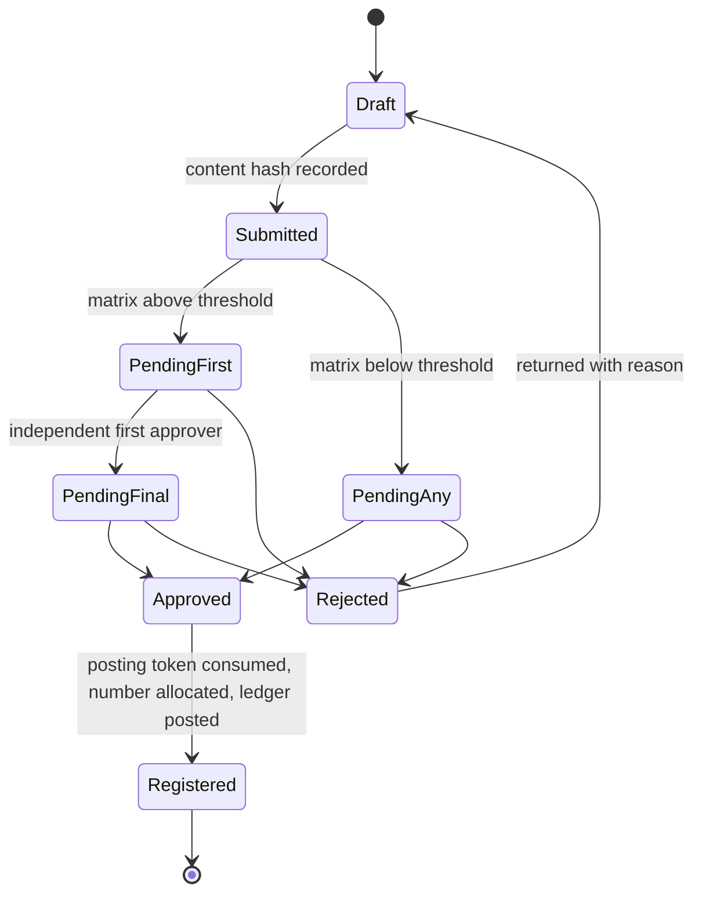

# 03 Domain Model

Entities, states, and the accounting effect of each document. Field-level schemas live in the code as migrations and in `04-api-contracts.md` as wire shapes; this file is the conceptual model every engineer must hold.

## Common shape of a document

Every business document has: `id` (ULID), `company_id`, `doc_type`, `number` (null until registered), `status`, `state_version`, `created_by`, `created_at` (db), `registered_at`, `registered_by`, `period_id`, `content_hash`, `prev_hash`, `hash`, `corrects_id` and `corrected_by_id` (nullable), `source_id` (the document it was created from), `dimensions` (cost centre plus configured dimensions), and `attachments[]` (object key, sha256, uploaded_by, uploaded_at). Lines carry `line_no`, `sku_version_id` or `account_id`, `qty`, `uom`, `unit_price`, `discount`, `tax_code_version_id`, `tax_amount`, `line_total`.

Draft documents are mutable and versioned (every save is a version row). Registered documents are immutable rows in immutable tables.

## Document lifecycle

Registered documents may later gain: annotations (append-only), reversal links, and status flags derived from later documents (paid, delivered, reversed), all of which are new rows, never updates.

## Item classes and stock

- SKU has `item_class` in {raw_material, finished_goods, both}. Sales sees finished goods; purchase buys raw material; `both` only by explicit configuration.
- Stock ledger line: `sku_id`, `warehouse_id`, `qty_delta`, `unit_cost`, `value_delta`, `movement_type` (receipt, delivery, production_consume, production_produce, adjustment, write_off, job_out, job_in, opening), `source_doc_id`. On-hand is the sum of `qty_delta`; value is the sum of `value_delta`; moving average is value over quantity per SKU per warehouse, recomputed on every receipt-type movement.
- Reservation: `order_line_id`, `sku_id`, `warehouse_id`, `qty`, `status` (active, released, consumed). Available equals on-hand minus active reservations. Reservation is created in the order transaction and consumed by the delivery note.
- Bill of materials: versioned; `finished_sku_id`, lines of `raw_sku_id`, `qty_per_unit`, `uom`, `wastage_allowance_pct`.

## Parties

- Customer (versioned): name, TRN, addresses[], contacts[], territory, group, credit_limit, payment_terms, price_list_id, price_agreements[], interest_rule, dunning_profile, on_hold flag.
- Vendor (versioned): name, TRN, addresses[], contacts[], group, bank_accounts[] (each change approved), payment_terms, currency, approved_status, scorecard.
- Bank-account change is its own approvable document referencing the vendor version.

## Ledger

- Account: code, name, type (asset, liability, equity, income, expense), group, is_postable, currency (AED), control_type (receivable, payable, bank, cash, pdc_in, pdc_out, stock, grni, vat_output, vat_input, retained_earnings, rounding, discount, variance).
- Journal: header (doc reference, period, posting_date, description) and lines (account, dimensions, debit, credit, currency, fx_rate, party_id). Constraint: per journal, per currency, sum(debit) equals sum(credit), enforced by a deferred constraint trigger.
- Period: fiscal year, month, status (open, soft_closed, hard_closed), plus one audit_adjustment period per year.
- Posting rule (versioned): match keys (doc_type, tax_code, item_class, dimension values, party group) to account roles (debit_account, credit_account, tax_account) with priority.

## Posting matrix

| Document | Debit | Credit |
| --- | --- | --- |
| Sales invoice (register) | Accounts receivable | Revenue, VAT output, (Discount contra), Rounding |
| Delivery note | Cost of goods sold | Finished goods inventory |
| Customer receipt cleared | Bank or Cash | Accounts receivable |
| PDC received | PDC in hand | Accounts receivable |
| PDC deposited | Bank | PDC in hand |
| PDC bounced | Accounts receivable | PDC in hand |
| Advance receipt | Bank | Customer advances |
| Advance applied | Customer advances | Accounts receivable |
| Credit note | Revenue, VAT output | Accounts receivable; plus Finished goods inventory / COGS if stock returns |
| Goods receipt | Raw material inventory | Received not billed |
| Landed cost | Raw material inventory | Freight, duty, clearing payable |
| Supplier invoice | Received not billed, VAT input | Accounts payable |
| Supplier invoice, import reverse charge | VAT input | VAT output (self-assessed) |
| Supplier advance | Vendor advances | Bank |
| Supplier payment | Accounts payable | Bank, PDC issued; FX difference to gain or loss |
| Debit note | Accounts payable | Raw material inventory or Received not billed, VAT input |
| Production entry | Finished goods inventory | Raw material inventory; excess wastage: Production variance / Raw material inventory |
| Stock count adjustment | Inventory or Stock variance | Stock variance or Inventory |
| Stock write-off | Expense (by reason) | Inventory |
| Petty cash voucher | Expense, VAT input | Petty cash |
| Contra (deposit) | Bank | Cash |
| Depreciation | Depreciation expense | Accumulated depreciation |
| Accrual | Expense | Accrued liabilities (auto-reverses) |
| Prepayment amortisation | Expense | Prepayments |
| Early-payment discount taken | Discount allowed | Accounts receivable |
| Overdue interest debit note | Accounts receivable | Interest income, VAT output if applicable |
| Period close (year) | Income accounts | Expense accounts, net to Retained earnings |

All account names above are account roles resolved through posting rules, not hard-coded codes.

## Numbering

Sequence per `(company_id, doc_type, fiscal_year)`. Allocation happens with `SELECT ... FOR UPDATE` on the sequence row inside the registration transaction. Voided numbers (a registration that failed after allocation) are recorded in `number_void` with reason; the sequence never rewinds. Print formats show the number with a configurable prefix.

## Approvals

- Approval matrix row: `doc_type`, `threshold_amount`, `below_mode` (any_one), `above_mode` (first_then_final or vote_n_of_m), `approver_roles_below[]`, `first_approver_roles[]`, `final_gate_role`, `vote_n`, `requires_step_up_above`.
- Approval request: `doc_id`, `content_hash`, `state`, `state_version`, `initiator_id`, `initiator_department`, `first_approver_id`, `final_approver_id`, decisions[] (`actor`, `decision`, `reason`, `at`, `hash_seen`), `delegations[]`, `fraud_hints[]`, `posting_token` (single-use, expiring).
- Segregation-of-duties matrix: role pairs and action pairs declared incompatible; evaluated at assignment and at decision time.

## Corrections

- Correction request: `original_doc_id`, `kind` (cosmetic, partial, structural, reversal_only), `reason`, `before_snapshot`, `after_snapshot`, `proposed_docs[]` (type and preview), `reality_checks[]` (delivered, allocated, emailed), approval request id, resulting doc ids.

## Clocks

- Clock: `doc_id`, `kind` (delivery_note, supplier_invoice, supplier_delivery_note, production_draft, approval_age), `started_at`, `due_at` (business hours via holiday calendar), `closed_at`, `closed_by_doc_id`, `escalated_at`.

## Analytics snapshot

- Snapshot: `version`, `company_id`, `as_of_date`, `computed_at`, `sections{}` each with figures, series, links, and its own `as_of`, `hash`, object key for the stored JSON and PDF. Served read-only; the phone caches by version.

## Journeys

- Journey definition: slug, title, group, personas[], steps[] with `kind` in {form, validate, write_draft, route, await, post, read}, requires_approval, doc types.
- Journey instance: definition, user, state JSON (untrusted), current step, created, updated, linked doc and approval ids. Resumable across days.

## Notifications

- Outbox: `event_id`, `aggregate`, `type`, `payload`, `created_at`, `published_at`, attempts.
- Notification: `event_id`, `recipient_id`, `channel`, `status`, `attempt_at`, `error`, `actioned_at`, `action`.
- Device token: `user_id`, `device_id`, `platform`, `token`, `app_version`, `registered_at`, `last_seen`.
- Preference: `user_id`, event types, channels, quiet hours, digest, per-device toggles.
- Alert rule: `doc_type`, condition expression, recipients by role, channel, severity, mode (advisory, blocking).

## Master data versioning

Every master table has a `_version` table with `valid_from`, `valid_to`, `approved_by`, `change_reason`. Documents reference `*_version_id`. Current view is `valid_to IS NULL`.
