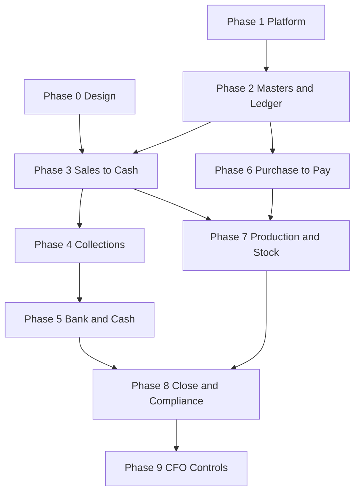

# 07 Tracks and Tasks

Workstreams (tracks) own disjoint modules and files so they can run in parallel with minimal merge overlap. Phases sequence the tracks. Every task has an ID, an owner track, dependencies, requirements it satisfies, and acceptance criteria that map to `08-acceptance-tests.md`.

## Team shape

- Track A Platform and Identity: 2 Go engineers; owns the internal kit (envelopes, idempotency, If-Match, RLS scoping, audit emission) every module uses.
- Track B Approvals, Audit, and Corrections: 2 backend engineers.
- Track C Ledger, Masters, and Compliance: 2 backend engineers, 1 accountant advisor part-time.
- Track D Operations Documents (sales, receivables, purchase, stock, production, bank): 3 backend engineers.
- Track E Notifications, Real Time, and Analytics: 2 backend engineers.
- Track F Mobile: 4 engineers, 2 Android (Kotlin, Compose) and 2 iOS (Swift, SwiftUI), working from one interaction spec and one shared test matrix; one of the four owns cross-platform parity.
- Track G Console (React): 3 front-end engineers.
- Track H Design: 1 product designer, 1 UX researcher part-time.
- Track I Platform Operations and Security: 1 SRE with on-premises Linux and PostgreSQL experience, 1 security engineer part-time; owns the single-NUC build, the compose stack, off-site anchoring and backups, and the restore rehearsal.
- Track J QA and Acceptance: 1 QA engineer plus the company's Accountant for acceptance.
- Product owner: one person with authority to decide scope, backed by the Accountant and one Stakeholder.

Backend tracks B through E are Go engineers. Thirteen to fifteen people at peak. Fewer people means the phases run longer, not that the phases change.

## Phases

- Phase 0 Experience design (Track H, with F and G reviewing). Runs alongside Phase 1.
- Phase 1 Platform. Tracks A, B, E (outbox and push), I, F and G shells.
- Phase 2 Masters and ledger. Track C, with G for master screens and import.
- Phase 3 Sales to cash. Track D, with F (agent, driver) and G (console documents).
- Phase 4 Collections. Track D, with F (collector) and G.
- Phase 5 Bank and cash. Track D, with E for forecast, G.
- Phase 6 Purchase to pay. Track D, with C for landed cost and FX, G.
- Phase 7 Production and stock, assets. Track D, with C, F (counter and supervisor), G.
- Phase 8 Close, reporting, compliance. Tracks C and E, with G.
- Phase 9 CFO controls and hardening completion. Tracks B, D, E, I.
- Phase 10 CRM. Spec: `14-crm.md`. Starts after Phase 3.
- Phase 11 HR. Spec: `15-hr.md`. Starts after the approval engine and cost centres exist.
- Phase 12 Payroll. Spec: `16-payroll.md`. Depends on Phase 11.

Each phase ends with acceptance by the Accountant using the real month of paper for the journeys in that phase, and with the phase's tests in `08` green in CI.

## Tasks

Format: ID, title, track, depends on, requirements, acceptance.

### Phase 0

- P0.1 Design tokens and component library in Figma exported to Compose, SwiftUI, and React. H. Depends: none. R15.6. Accept: tokens consumed by both client shells; RTL and dark mode switch without layout breaks.
- P0.2 Prototypes for the ten flows in `06`. H. Depends: P0.1. R15.5, R13.4. Accept: each prototype passes a first-attempt task with an unfamiliar participant of the right persona.
- P0.3 Usability protocol and sessions. H, J. Depends: P0.2. Accept: written findings per flow with fixes applied before the corresponding build task starts.

### Phase 1 Platform

- P1.1 Repository, CI, licence scan, module boundary lint, OpenAPI generation, contract drift check. A. R17.6. Accept: PR fails on GPL dependency, on module boundary violation, on OpenAPI drift.
- P1.2 Zitadel headless deployment (unmodified, pinned), gRPC clients from Apache protos, session-brokering endpoints, ERP token issuer with KMS-held signing keys and JWKS, MFA enforcement by role, device enrolment with DPoP verification at the gateway, refresh rotation with reuse detection, step-up tokens, console custom login proxying OIDC. A. R1.3 to R1.8, R1.15. Accept: tests A1 to A10 in `08`.
- P1.3 Users, roles, permissions as data, RLS session variables, field-level serialiser permissions, SoD matrix, access review job. A. R1.2, R1.9 to R1.14. Accept: tests A11 to A16.
- P1.4 Company, fiscal periods, holiday calendar, business-hours clock service, numbering sequences. C. R4.5, R4.6, R13.8. Accept: tests C1 to C5.
- P1.5 Immutable-table pattern: migration helper that creates a table with owner role, grants, triggers, hash columns, chain append with advisory lock and chain head; DDL event trigger; nightly trigger presence check. B, I. R3.1 to R3.5. Accept: tests B1 to B8.
- P1.6 External anchoring worker, KMS signing, compliance-mode bucket, daily anchor email, verifier with anchor comparison. B, I. R3.6. Accept: tests B9 to B11.
- P1.7 Approval engine: matrix config, request lifecycle with row lock and state version, independence and SoD checks, reason enforcement, decision-field restoration, posting token, delegation, fraud hints, audit at every transition, commit-before-raise. B. R2.1 to R2.11. Accept: tests D1 to D14.
- P1.8 Outbox table and worker, event schema validation, WebSocket hub with per-user subscriptions and acks, FCM v1 and APNs senders, data-only payloads, token lifecycle, retries, dedupe, preferences, quiet hours, digest, alert rule table. E. R13.1 to R13.7. Accept: tests E1 to E12.
- P1.9 Object storage with object lock, attachment service with SHA-256 verify on read, rendered PDF store. A. R3.9, R3.10. Accept: tests B12, B13.
- P1.10 Error envelope, idempotency keys, If-Match handling, pagination, rate limiting with envelope, health and status endpoints. A. R17.4. Accept: tests A17 to A20.
- P1.11 Mobile shells: Android (Kotlin, Compose) and iOS (Swift, SwiftUI) projects with generated OpenAPI clients, design tokens, Keystore and Keychain secure store, device enrolment, DPoP client, auth flow with expiry enforcement, app lock, root detection, push registration bound to auth state, deep link stash and resume, notification channels, approval sheet, notification centre. F. R16.1 to R16.7, R13.4, R15.6. Accept: tests F1 to F14.
- P1.12 Console shell: React app, tokens, OIDC, command bar, left rail, notification drawer, live badges, approval split view with sheet, admin settings framework with history. G. R15.1, R15.3. Accept: tests G1 to G6.
- P1.13 Compose stack and single-NUC baseline: one `docker-compose.yml` with `dev` and `prod` profiles, multi-arch buildx pipeline (amd64 and arm64) pushing pinned digests, systemd units for compose on the NUC with restart and health checks, Caddy ingress with automatic TLS or Cloudflare Tunnel or Tailscale Funnel when no inbound port is allowed, Tailscale for operator access, unattended OS updates with a nightly maintenance window and reboot, UPS integration with clean shutdown, fail-fast env validation, secrets via Vault agent or age-encrypted files, observability and pgaudit shipped off-prem with a local buffer, status page reachable from the System Manager phone over the tunnel, disk, clock, WAL-lag, and UPS alerts. I. R17.1 to R17.6. Accept: tests I1, I9, I10 to I14.
- P1.15 Off-site bucket, KMS, backup, restore, and anchoring: local object-lock bucket on the second disk for staging, off-site cloud S3-compatible compliance-mode bucket and off-prem KMS or Vault Transit key, continuous WAL archiving to off-site, backup engine with manifests and refusal codes and success only after off-site verification, anchor worker signing with the off-prem key, anchor and backup failure alerts, chain verification against anchors, spare-NUC or procurement lead time recorded with management. I, B. R3.6, R3.11, R17.2, R17.3. Accept: tests B9 to B11, I2 to I8, I15, I16.
- P1.17 External-drive backup target: UUID allow-list detection, udev or systemd mount unit, LUKS unlock from the secrets store or age-encrypted archives, same manifest and proofs as off-site, re-read verification, safe-to-remove signal, per-drive retention and pruning after verification, missing or full drive alerts, separate drive status on the status page and exceptions report, precedence rule per R17.13. I. R17.7 to R17.13. Accept: tests I19 to I24.
- P1.18 Drive rotation and chain of custody: two-drive rotation schedule, hand-over entry from console and phone, audit event per hand-over, acknowledgement by System Manager, overdue-drive listing on the exceptions report, quarantine of a returning drive whose chain head does not match its anchor. I, B. Accept: tests I25, I26.
- P1.19 Restore-drill command and schedule: isolated compose project with separate PostgreSQL data directory and port and MinIO bucket prefix, restore from either target, integrity proofs (checksums, counts, ledger balance, chain versus anchor, attachment hash sample), API boot against restored data, smoke suite, production row counts recorded before and after, signed drill report stored off-site and in the chain, weekly timer on the NUC, monthly run onto a separate machine, status page and exceptions report entries, Critical on failure or overdue, production restore path with Stakeholder approval and restore audit event. I, B. R17.14 to R17.19. Accept: tests I17, I27 to I34.
- Pre-go-live gate for Track I: a drill has passed from BOTH targets (external drive and off-site bucket) onto a clean machine, the two restored chain heads are identical and match the anchor, and the drill reports are stored. Go-live is blocked until this gate is recorded.
- P1.14 Journey engine: definitions, instances, step protocol, resumability, persona visibility. E. Accept: tests E13 to E15.

### Phase 2 Masters and ledger

- P2.1 Chart of accounts seed, tax codes, dimensions, posting-rules engine (versioned, approved), journal posting with balance constraint, manual journal controls, accruals and prepayments with auto-reverse, recurring journals. C. R4.1 to R4.4, R4.10 to R4.13. Accept: tests C6 to C14.
- P2.2 Master data with versioning and four-eyes: customers, vendors, SKUs with item class and units, BOMs, price lists, price agreements, floor prices, credit limits, payment terms, vendor bank accounts as approvable change. C. R3.8, R5.2 to R5.4, R8.1, R9.1, R9.3. Accept: tests C15 to C22.
- P2.3 Stock ledger, moving average, reservations, availability query with role-filtered fields. D. R9.2, R5.1, R5.5. Accept: tests H1 to H6.
- P2.4 Print format designer with versions; print preview; stored PDF at registration. G, C. R3.9. Accept: tests G7, G8.
- P2.5 Import service with preview and rejection reasons; Go-Live journey with opening balances and zero trial balance gate. C, G. R18.1, R18.2. Accept: tests C23 to C26.
- P2.6 Day Book, Cash Book, Bank Book, party ledgers, saved views, scheduled reports. E, G. R14.4, R14.6. Accept: tests G9 to G11.
- P2.7 Console master screens and admin screens (matrix, alert rules, SoD, calendars, numbering). G. Accept: usability pass for admin flows.

### Phase 3 Sales to cash

- P3.1 Sales order with credit check, price floor hold, price agreements, reservation, offline pending-reservation handling, order timeline. D. R5.2 to R5.5. Accept: tests S1 to S8.
- P3.2 Sales invoice draft from order, Article 59 validation, submit, approval, registration with numbering, ledger posting, PDF store, gate pass enablement. D, C. R5.6, R5.7, R12.1. Accept: tests S9 to S16.
- P3.3 Gate pass and delivery note with COGS posting, partial delivery and backorder, delivery-note clock, driver proof of delivery closing the clock. D. R5.8, R5.9. Accept: tests S17 to S22.
- P3.4 Credit note, cash sale, sales targets and commission on collection. D. R5.10 to R5.12. Accept: tests S23 to S27.
- P3.5 Correction requests and wizard for sales documents (extends to all families as they land). B. R11.1 to R11.5. Accept: tests D15 to D22.
- P3.6 Mobile: agent My Day, Stock, Take Order, Order timeline; driver Trip with offline capture; encrypted offline store and outbox. F. R15.5, R15.8. Accept: tests F15 to F24.
- P3.7 Console: order, invoice, gate pass, delivery note forms; keyboard-first grid; voucher templates; duplicate-last; correction wizard; document flow graph; work queue. G. R15.1 to R15.3. Accept: tests G12 to G18.
- P3.8 Posting tolerance per user, blocking validation rules, early-payment discount terms. B, C. Accept: tests D23 to D25.

### Phase 4 Collections

- P4.1 Receivables model and dashboard with aging by due date and PDC-covered split; receipts with allocation, on-account, advances; PDC lifecycle; bounce handling. D. R6.1 to R6.3. Accept: tests R1 to R10.
- P4.2 Customer statements, party ledgers, dunning, overdue interest, credit review queue, concentration indicator. D, E. R6.4 to R6.7. Accept: tests R11 to R16.
- P4.3 Mobile collector screens; WhatsApp and email share; receipt capture with cheque photo. F. Accept: tests F25 to F29.
- P4.4 Console allocation screen and payment reconciliation. G. R7.3. Accept: tests G19, G20.

### Phase 5 Bank and cash

- P5.1 Statement import (CSV, MT940), open-finance feed with consent flow, reconciliation with rules, unreconciled ledger. D. R7.1 to R7.3. Accept: tests K1 to K8.
- P5.2 Petty cash, contra, cheque register, bank facilities. D. R7.4, R7.5, R7.8. Accept: tests K9 to K13.
- P5.3 Payment release with second approver and bank file generation. D, B. R7.6. Accept: tests K14 to K16.
- P5.4 Thirteen-week forecast, floor alert, daily cash position section. E. R7.7, R7.9. Accept: tests K17 to K20.
- P5.5 Console reconciliation screen; mobile cash sections in the brief. G, F. Accept: usability pass.

### Phase 6 Purchase to pay

- P6.1 Vendor onboarding and bank-change approval, requisition and quotes, LPO with cap and FX, registration, email with stored communication. D. R8.1 to R8.4. Accept: tests P1 to P9.
- P6.2 Goods receipt, landed cost, Bill of Entry and reverse charge, three-way match with tolerance, duplicate detection, supplier invoice posting, debit notes, advances, attachment clocks. D, C. R8.5 to R8.8. Accept: tests P10 to P20.
- P6.3 Payment run with batch approval and release; supplier scorecard; inbound mailbox to draft supplier invoice. D, E. R8.8 to R8.10. Accept: tests P21 to P26.
- P6.4 Console purchase forms, bulk actions, inbound queue. G. Accept: tests G21 to G23.

### Phase 7 Production, stock, assets

- P7.1 Production entry with BOM proposal, wastage allowance, variance approval, draft-age clock, yield reporting. D. R9.4. Accept: tests H7 to H12.
- P7.2 Stock count by independent counter, variance approval, write-offs with reason codes, reorder suggestions, dead stock, ageing, monthly per-SKU report; job work optional. D. R9.5 to R9.8. Accept: tests H13 to H20.
- P7.3 Fixed asset register with depreciation and disposal; expense claims and staff advances. C. R10.1, R10.2. Accept: tests C27 to C31.
- P7.4 Mobile counter and supervisor flows on phone or tablet. F. Accept: tests F30 to F32.

### Phase 8 Close, reporting, compliance

- P8.1 Sub-ledger close sequence, month-end checklist journey, soft and hard close, audit adjustment period, year-end close and carry-forward, VAT payment and filed-return documents. C. R4.6 to R4.9, R12.4. Accept: tests C32 to C40.
- P8.2 Reports in R14.4, ratio analysis, exceptions report, access review report, chain verification report; exports CSV, Excel, Tally XML, auditor bundle. E, C. R14.3, R14.4, R14.7. Accept: tests E16 to E24.
- P8.3 FTA Audit File and VAT return file generators per the FTA requirements document; Article 59 compliance suite; PINT AE field storage audit; corporate tax provision. C. R12.2, R12.3, R12.5. Accept: tests C41 to C46.
- P8.4 Stakeholder snapshot builder, versioned storage, management pack generation and push, on-device rendering with hash footer, brief sections wired. E, F. R14.1, R14.2, R14.5. Accept: tests E25 to E32, F33 to F38.
- P8.5 E-invoicing ASP connector (PINT AE XML, transmission, status as new records, retry and alert). C. R12.6. Accept: tests C47 to C50. Scheduled before the applicable 2027 deadline.

### Phase 9 CFO controls and hardening completion

- P9.1 Manual journal and back-dating controls on the exceptions report; correction-rate metrics; break-glass path. B. R3.14, R4.10, R11.5. Accept: tests D26 to D30.
- P9.2 Quarterly access review workflow; SoD matrix admin; session limits and IP allow-list for console. A. R1.13 to R1.15. Accept: tests A21 to A24.
- P9.3 Working-capital KPIs (DSO, DPO, DIO, CCC), margin per SKU and customer, receivable concentration, debtor payment performance in snapshot and console. E. R14.2, R14.3. Accept: tests E33 to E36.
- P9.4 Penetration test remediation; MASVS and ASVS verification; licence and SBOM sign-off. I. Accept: external report with no high findings open.

### Phase 10 CRM

Leads and pipeline. Converts into the existing customer master. Spec: `14-crm.md`. Starts after Phase 3.

### Phase 11 HR

Employees, documents expiry, and leave on the existing approval engine. Spec: `15-hr.md`. Starts after the approval engine and cost centres exist.

### Phase 12 Payroll

UAE monthly pay, WPS file, and a gratuity or pension path. Posts through the existing ledger. Spec: `16-payroll.md`. Depends on Phase 11.

## Dependencies at a glance

Phases 4 and 6 can run in parallel after Phase 3 and Phase 2 respectively, which is where the second and third Track D engineers spend their time.

## Definition of done for any task

- Requirements listed in the PR and satisfied.
- Contract changes landed in `04` first and OpenAPI regenerated.
- Tests in `08` for the task green; new invariants added where the task introduced one.
- Migrations reviewed by Track B if they touch an immutable table.
- Audit events emitted for every state change; verified by a test.
- Strings externalised in English and Arabic; RTL checked for any new screen.
- Accessibility check passed for any new screen.
- Runbook entry added if the task introduced an operational component.
