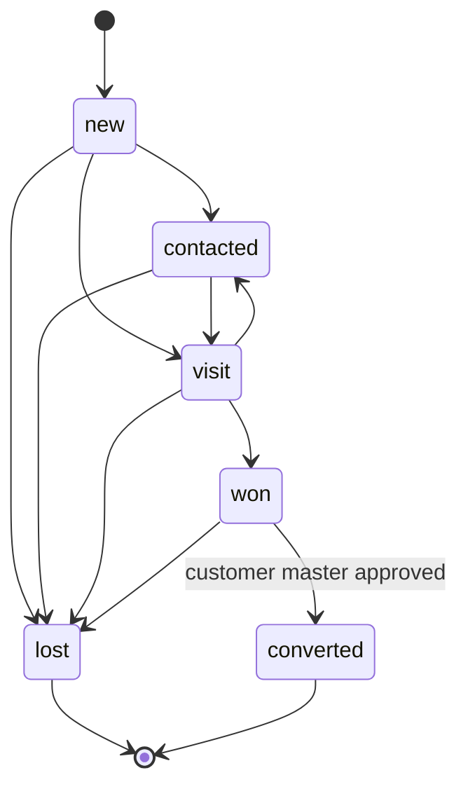
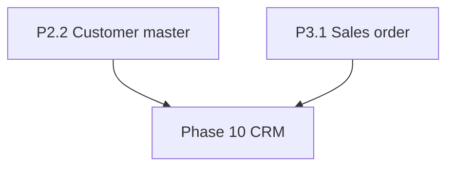

# 14 CRM

Phase 10. CRM is the pre-customer pipeline for this UAE trading company. Sales people record who they are talking to before that company is an approved customer. The customer master, sales orders, invoices, and collections already exist in Phases 2 to 4 and stay there. CRM creates a lead and, on a won conversion, hands the account to the existing customer master. It does not redesign accounting or sales documents.

Phase 10 starts only after Phase 3 customer and sales-order tasks exist. In this plan those tasks are P2.2 (customer master with four-eyes) and P3.1 (sales order). No P10 task is built before both exist.

Test-driven development applies. When a task is built, its acceptance test in this file is written first and seen to fail, then the task is implemented. This file does not implement those tests. The owner of `08-acceptance-tests.md` copies the CR cases across; do not renumber them.

Out of this phase: website, web-to-lead, marketing campaigns, newsletters, email blasts, loyalty, and coupons. Also out: a quotation document, an automatic sales order, and any ledger posting from a lead.

## Requirements

R19 is CRM. These IDs are not yet in `01-requirements.md`; that index has another owner.

- R19.1 The system SHALL store accounts (prospect companies) and leads as records distinct from the approved customer master. A lead or an account SHALL NOT be accepted as the customer on a sales order, invoice, receipt, or any other financial document.
- R19.2 An account SHALL have contacts. A lead SHALL belong to exactly one account. A contact SHALL belong to exactly one account.
- R19.3 An activity SHALL be a call, a visit, or a note, attached to one lead, and SHALL record the actor, the time, and the text. An activity SHALL be append-only.
- R19.4 A lead SHALL be assigned to exactly one user who holds Sales Agent. Reassignment SHALL write an audit event naming the previous assignee and the new assignee. A Sales Agent SHALL list only leads assigned to that agent.
- R19.5 Pipeline stages SHALL be new, contacted, visit, won, lost, and converted. Every stage change SHALL write an audit event with the previous stage, the new stage, the actor, and the time. A move to lost SHALL require a non-empty reason. A lost lead SHALL remain readable and SHALL NOT be deleted.
- R19.6 A lead SHALL NOT post to the ledger, SHALL NOT allocate a fiscal document number, and SHALL NOT be a registered financial document. A stage change SHALL NOT change a ledger balance.
- R19.7 Lost leads and converted leads SHALL be retained. Hard delete of a lead, account, contact, activity, or stage audit row SHALL be refused.
- R19.8 Conversion SHALL be allowed only from won. It SHALL open a customer master draft from the account and submit that draft through the existing four-eyes master approval (P2.2). The submitting Sales Agent SHALL NOT approve it. Approval SHALL set the lead to converted and store the approved customer id. Rejection SHALL leave the lead at won, store no customer id, and keep the approval reason. Conversion SHALL NOT create a sales order, invoice, or receipt.
- R19.9 CRM SHALL use only existing roles. Sales Agent works assigned leads. Accountant reads the company pipeline and does not move stages. Stakeholder reads the company pipeline; the finance manager, the CFO, and the partner hold Stakeholder and are not new roles. Approver decides the customer master only and SHALL NOT also hold Sales Agent (existing segregation of duties). Auditor reads leads and the stage audit and cannot change them. Field sales uses the existing Android and iOS apps. The console is the desk view.
- R19.10 CRM SHALL NOT include a website, a web-to-lead form, a marketing campaign, a newsletter, an email blast, loyalty, or coupons.

## Domain sketch

One page. Field-level schemas, when built, land in `04-api-contracts.md` first. This sketch is the model.

CRM rows are working records, not financial documents. They carry `company_id`. A lead carries `owner_id` (the assigned Sales Agent) and `territory_id` taken from its account. They have no fiscal number, no registration, and no ledger lines. Stage changes and assignment changes are audit events on the existing audit path. The lead row may update its current stage; the audit event is the history and is not edited.

### Entities

- Account: prospect company. name, territory_id, addresses[], note. No credit limit, price list, or payment terms. Those stay on the customer master.
- Contact: account_id, name, phone, email, job title.
- Lead: account_id, title (what is being discussed), assigned_to, territory_id, stage, lost_reason, lost_reason_text, customer_id (null until converted), state_version.
- Activity: lead_id, kind in {call, visit, note}, body, actor_id, occurred_at. Append-only.
- Stage audit: an audit event. It carries lead id, from_stage, to_stage, actor, time, and a reason when the new stage is lost.

Lost reasons, seeded and not free-form except the last: price, competitor, no_requirement, no_response, not_our_goods, other. Reason other requires lost_reason_text.

### States

`converted` is set only when the existing customer approval succeeds. A rejected approval leaves the lead at won. A user cannot type `converted` as a manual stage move. Lost and converted are closed. They are not deleted, and they are not reopened; a later conversation is a new lead on the same account.

### Handoff

Conversion copies the account name, addresses, and contacts into a customer master draft and submits the existing four-eyes approval. Credit limit, payment terms, and price list are entered on that draft by the existing customer master, not invented here. Until that customer is approved, sales orders continue to require an approved customer and cannot point at the lead. After approval, later sales orders use the customer id as they do today.

### Who sees what

- Sales Agent (`sales_agent`): leads assigned to that agent. Capture is on the existing phone apps. The same own-scope applies if they open the console.
- Accountant (`accountant`): company read on the console. No stage moves, no conversion submit, no delete.
- Stakeholder (`stakeholder`): company read on the console. This is the management view for the finance manager, the CFO, and the partner.
- Approver (`approver`): no pipeline screen of their own. They see the existing customer-master approval only. A user cannot hold Sales Agent and Approver together.
- Auditor (`auditor`): company read of leads, activities, and stage audit. No writes.

## Tasks

Format as in `07-tracks-and-tasks.md`: ID, title, track, depends, requirements, acceptance.

### Phase 10 CRM

Phase 10 starts only after Phase 3 customer and sales-order tasks exist (P2.2 and P3.1).

- P10.1 Accounts, contacts, and leads, distinct from the customer master, refused as the party on a sales document, and with no fiscal number. D. Depends: P2.2, P3.1. R19.1, R19.2, R19.6, R19.10. Accept: tests CR1 to CR4, CR32.
- P10.2 Activities (call, visit, note), append-only, and assignment to one Sales Agent with an audited reassignment. D. Depends: P10.1. R19.3, R19.4. Accept: tests CR5 to CR8.
- P10.3 Pipeline stages, lost reason, stage-change audit, no delete, no ledger effect. D, B. Depends: P10.1. R19.5, R19.6, R19.7. Accept: tests CR9 to CR14.
- P10.4 Conversion of a won lead into the existing customer master through four-eyes; rejection returns the lead to won; no sales order is created. D, C, B. Depends: P10.3, P2.2, P1.7. R19.8. Accept: tests CR15 to CR19.
- P10.5 Row visibility and segregation of duties on existing roles only: Sales Agent own, Accountant and Stakeholder company read, Approver only on the customer gate, Auditor read. A. Depends: P10.1, P1.3. R19.9. Accept: tests CR20 to CR24.
- P10.6 Phone: own leads plus call, visit, and note on the existing Android and iOS apps, reusing the existing offline outbox. F. Depends: P10.2, P10.3, P3.6. R19.4, R19.9. Accept: tests CR25 to CR27.
- P10.7 Console desk pipeline for Accountant and Stakeholder, with lost reasons and conversion only from won. G. Depends: P10.3, P10.4, P10.5, P3.7. R19.8, R19.9. Accept: tests CR28 to CR31.

## Acceptance tests

Named cases a later agent implements. Write the test for a task before the behavior. Do not renumber.

- CR1 An account and a lead save with a null customer id, and the sales-order customer picker rejects both ids.
- CR2 Creating a lead inserts no customer row, no journal line, and no fiscal number allocation.
- CR3 A contact saved on account A is refused on account B.
- CR4 Hard delete of an account, contact, or lead is refused by the application role.
- CR5 A call, a visit, and a note append to a lead; a later update or delete of that activity is refused.
- CR6 Assigning a lead to a user who does not hold Sales Agent is refused.
- CR7 Reassignment writes an audit event that names the previous assignee and the new assignee.
- CR8 A Sales Agent list returns only that agent's leads, and the reported count equals the rows across pages.
- CR9 A move from new to contacted writes an audit event with from, to, actor, and time, and the lead's current stage is contacted.
- CR10 A move to lost without a reason is refused, and the stage stays unchanged.
- CR11 A lost lead remains readable with its reason; delete is refused.
- CR12 A stage change leaves ledger debits and credits unchanged and writes no journal.
- CR13 After every stage, the lead's fiscal document number is still null.
- CR14 Two concurrent stage moves leave one linear history: the second move's audit `from` is the stage the first move wrote.
- CR15 Conversion from any stage other than won is refused.
- CR16 Conversion from won creates a customer master draft and an approval request, and does not insert an approved customer.
- CR17 The Sales Agent who submitted the conversion cannot approve that customer master.
- CR18 While the customer approval is pending or rejected, a sales order cannot reference the lead or a customer id produced from it.
- CR19 When the existing approval registers the customer, the lead stage is converted and stores that customer id. A rejection leaves the lead at won, stores no customer id, and keeps the reason. No sales order exists in either case.
- CR20 An Accountant can read every lead in the company and a stage move by that Accountant is refused.
- CR21 A Stakeholder can read every lead in the company, including leads assigned to other agents.
- CR22 An Auditor can read leads and stage audit events and cannot write them.
- CR23 A caller with no lead permission receives a denial, and an empty lead list for that caller reports a count of zero.
- CR24 Lead and activity payloads for a Sales Agent contain no cost or margin fields.
- CR25 The Sales Agent phone lists only that agent's leads.
- CR26 A visit logged offline is stored in the existing outbox and applied once when the outbox replays.
- CR27 A stage move from the phone is refused when the lead is assigned to a different agent.
- CR28 Console stage counts for an Accountant and for a Stakeholder equal the lead rows that role can read.
- CR29 The console lost list shows the reason and has no delete action.
- CR30 The console offers conversion only when the stage is won, and choosing it opens the existing customer approval, not a sales order.
- CR31 An Approver has no pipeline edit action; their only CRM-related decision is the customer master approval.
- CR32 The CRM surface has no campaign, newsletter, coupon, loyalty, or public website lead endpoint.

## Dependencies

Phase 10 does not feed the ledger, the sales invoice, or collections. Phases 4 to 9 do not wait on it.
