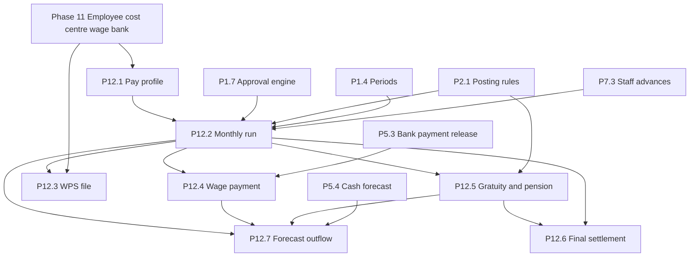

# 16 Payroll

Phase 12 is UAE payroll for the one company on the AED ledger. It produces the salary cash outflow that the thirteen-week forecast already treats as a recurring outflow. It does not add a second employee master. The employee, the cost centre, and the wage bank account come from Phase 11 in `15-hr.md`.

This file is the plan for that phase. It is the addendum to the task list in `07-tracks-and-tasks.md`, the requirements in `01-requirements.md`, and the acceptance lines in `08-acceptance-tests.md`. Those files are not edited here. Nothing in this phase is legal advice. Counsel and the company's PRO confirm every rate, threshold, service band, and file layout before anyone treats it as a figure the company will pay.

When Phase 12 is built, the tests below are written first and must fail before implementation, following Test-driven development in `10-execution-playbook.md`. This change writes no application code, no migration, and no test.

## Scope

One UAE company. One ledger currency, AED (R4.2). Wages are paid through the Wages Protection System: the company sends a salary file to its bank or to an exchange house so the Ministry of Human Resources and Emiratisation can see that wages were paid. End-of-service gratuity is accrued for employees the PRO places on that path. Where the PRO places an employee on a UAE or GCC pension scheme, the employer contribution is accrued instead, and gratuity is not booked for that employee.

A payroll run, a wage payment, a pension contribution payment, and a final settlement are documents. Each follows the lifecycle in `03-domain-model.md`: draft, submit, approval through the engine in P1.7, then registration. Registration consumes a single-use posting token (R2.8), allocates a number (R4.5), posts through the versioned posting-rules table (R4.4), and becomes immutable (R3.1). A registered document is not edited. A correction is a later run that references the original, approved again, and posted in the current open period (R3.7, R4.6).

## Out of scope

- R21.12 The product SHALL NOT add multi-country payroll, a second ledger currency for wages, a time-clock or attendance-hardware product, or a loan product. Days and unpaid leave are quantities entered on the run. Staff advances remain the documents in P7.3 (R10.2). A payroll deduction may recover an outstanding advance. It SHALL NOT open a new loan.

UAE employment income is not withheld as PAYE. This phase SHALL NOT add an income-tax table, a PAYE table, or a wage-withholding tax code. Corporate tax provisioning stays R12.5 and is not a deduction from salary.

## Requirements

- R21.1 Pay components SHALL be configuration, effective-dated and versioned like other master data (R3.8). The kinds are basic, allowance, and deduction. Exactly one component on an employee pay profile is basic. There SHALL be no component kind for income tax, PAYE, or wage withholding.
- R21.2 An employee pay profile SHALL reference the Phase 11 employee. It SHALL store component amounts and one benefit path: end-of-service gratuity, or a named pension scheme. It SHALL NOT copy the employee name, the cost centre, or the wage bank account into a second master. A registered run SHALL store the Phase 11 version ids it used for the employee, the cost centre, and the wage bank account.
- R21.3 A monthly payroll run SHALL be one document for one pay month, with one calculation per included employee. It SHALL pass the approval engine (R2) before registration. The preparer SHALL NOT approve it (R2.3). Salary amounts SHALL use the existing field permission for salary-like fields.
- R21.4 Registration of a payroll run SHALL post, in AED, through posting rules: salary expense and net wages payable, each employee to that employee's Phase 11 cost centre. Unpaid leave SHALL reduce that month's payable. Leave encashment SHALL increase it. Recovery of a P7.3 staff advance SHALL reduce the open advance and SHALL NOT be a supplier payment.
- R21.5 A registered payroll run, wage payment, pension contribution payment, and final settlement SHALL be immutable. The correction SHALL be a later document of the same family with `corrects_id` set to the original. The later document posts only the difference, in the current open period, after a new approval. Posting into a hard-closed period SHALL be refused (R4.6).
- R21.6 A registered payroll run SHALL be exportable as a WPS salary file for the company's bank or exchange. The file carries the fields in "WPS salary file" below. The layout (record names, order, lengths, separator, and file name) SHALL be configuration marked confirmed by the company's bank before an export is allowed. The exported bytes and their SHA-256 SHALL be stored on the run (R3.10). A new export is a new stored file. The registered run is not changed to repair a rejected file.
- R21.7 Payment of net wages SHALL be a wage payment from a company bank account, allocated to open payroll-register lines (the net payable per employee per run, including a final settlement's net when that net is being paid). It SHALL be a different document from the supplier payment run (P6.3) and from the supplier bank file (P5.3, R7.6). Outgoing money at or above the configured threshold SHALL require a second Stakeholder and step-up before release (R1.6, R7.6). A wage payment SHALL NOT exceed the open net on the lines it allocates to. A supplier payment run SHALL NOT select payroll-register lines.
- R21.8 Employees on the gratuity path SHALL accrue an end-of-service provision each registered payroll month. The formula SHALL be the configuration named "UAE Labour Law end-of-service gratuity", citing Federal Decree-Law No. 33 of 2021 on the regulation of employment relationships. Counsel confirms the article in force and writes the band day-counts, the wage base, the divisor, the minimum service, and the cap into that configuration. Those values SHALL NOT be literals in code. The familiar day-count formula SHALL NOT be compiled in. The auto-reversing accrual in R4.11 does not fit: that document reverses in the next period, and this provision has to stay until settlement. The provision posts through the posting-rules table and does not auto-reverse. The balance at go-live SHALL be an approved opening figure, not a catch-up computed by the first run.
- R21.9 Employees the PRO assigns to a pension path SHALL NOT accrue gratuity. Registration SHALL post the employer contribution as pension expense and pension payable, by cost centre, and SHALL post any employee share as a deduction that reduces net pay and credits the same payable. The scheme is the one the PRO has registered: the UAE scheme that covers the company's nationals (GPSSA or another scheme counsel names) or, for a GCC national, the home-country scheme under the GCC pension extension. Rates, the salary ceiling, and the components that form contribution salary SHALL be configuration confirmed by counsel and the PRO. Payment of the contribution to the scheme SHALL be a pension contribution payment from the bank, allocated to that payable, and SHALL NOT be a line on the WPS salary file.
- R21.10 A final settlement SHALL be one document for one Phase 11 employee. It SHALL include unpaid salary, the leave balance to encash, end-of-service under the same confirmed formula, and deductions (including any open P7.3 advance). For a pension-path employee the end-of-service line SHALL be zero and the provision SHALL NOT be drawn. It SHALL pass the approval engine, post through posting rules (expense or provision true-up, and settlement payable), and store a statement with its hash. The same days SHALL NOT be paid on both a monthly run and a settlement.
- R21.11 Once a payroll run or final settlement is registered, its open net payable, and any employer pension payable, SHALL be a dated cash outflow on the thirteen-week forecast (R7.7, P5.4). A configured placeholder for salaries SHALL NOT be added again for the same pay date. This phase is the source of that outflow. The expected pay date is company configuration.

## Configuration for counsel and the PRO

The system ships these parameters empty of statutory figures. A run that needs a parameter SHALL NOT register while that parameter is unconfirmed. Confirmation is an audit event (R3.12) naming the person, the role (counsel or PRO), and the date. The company keeps the advice. This spec does not restate it as a number.

End-of-service formula. Plain obligation: a private-sector employer pays an end-of-service gratuity to a worker the labour law treats as entitled to it, from basic wage and length of service. Default name: UAE Labour Law end-of-service gratuity (Federal Decree-Law No. 33 of 2021). Counsel confirms the text in force, including the article number. Configuration holds: service bands (from year, to year, days of wage per year), whether a partial year is pro-rated, which pay components form the wage base, the divisor that turns a month of basic into a day, the minimum continuous service before any amount is recognised, the cap, and whether unpaid absence reduces service. The PRO sets the path on each pay profile. Code SHALL NOT infer the path from a nationality field by itself.

Pension contribution. Plain obligation: for a UAE national, and for a GCC national covered by the home-country scheme, the employer pays the pension contribution the scheme requires, and does not book gratuity in its place. Configuration holds: scheme name, employer rate, employee rate (zero if counsel says the employee pays none), contribution salary ceiling, and which components form that salary. Counsel and the PRO confirm the values and which employees are on the path.

Leave in the month and at settlement. Plain obligation: unpaid absence reduces pay for that month, and leave the law or the contract requires to be paid out is encashed. Configuration holds: which components form a day's pay for unpaid leave, which form a day's pay for encashment, and the day divisor. The days themselves are entered on the run or the settlement. If Phase 11 stores a leave balance, the settlement reads it. This phase does not open its own leave ledger.

WPS salary file layout. Plain obligation: private-sector wages are paid through WPS by a bank or an exchange, using the salary file that agent accepts. Configuration holds the layout the company's bank confirms: record names, field order, lengths, padding, separator, file name, which components are fixed income, which are variable income, and which final-settlement amounts belong in the file rather than in a separate transfer. Export stays blocked until that confirmation is recorded.

Pay date. The day of the month the forecast should expect salary cash to leave is company configuration. It is not a statutory rate.

## WPS salary file

The file is produced from a registered run so the amounts match the ledger. Many banks use a salary information file with one employer control record and one employee detail record per worker. Whether this company uses that shape, including the record codes, is the bank confirmation above.

The control record carries: the employer establishment identifier the Ministry and the bank already hold, the routing code of the employer's bank or exchange agent, the file creation date, the file creation time, the salary month, the count of employee records, the total amount, the currency AED, and an employer reference when the layout has one.

Each employee record carries: the worker identifier from the Phase 11 employee (which identifier is the one the bank wants is part of the bank confirmation, agreed with the PRO), the routing code of the employee's bank or agent, the wage account from the Phase 11 wage bank account, the pay period start, the pay period end, the days in the period, the fixed income amount, the variable income amount, and the unpaid leave days.

An employee with no Phase 11 wage bank account, no worker identifier, or no cost centre SHALL be excluded from registration of a WPS line. Variable amounts are entered on the run. They are not read from a clock.

## Ledger effect

Account names here are roles in the posting-rules table, as in the posting matrix in `03-domain-model.md`. They are not hard-coded account codes. Every journal balances in AED (R4.1, R4.2).

| Document | Debit | Credit |
| --- | --- | --- |
| Payroll run, earnings | Salary expense by component and cost centre | Net wages payable |
| Payroll run, unpaid leave | (lower salary expense) | (lower net wages payable) |
| Payroll run, leave encashment | Salary expense by cost centre | Net wages payable |
| Payroll run, staff advance recovery | Net wages payable | Staff advances |
| Payroll run, employee pension share | Net wages payable | Pension payable |
| Payroll run, employer pension (pension path) | Pension expense by cost centre | Pension payable |
| Payroll run, gratuity increment (gratuity path) | End-of-service expense by cost centre | End-of-service provision |
| Wage payment | Net wages payable | Bank |
| Pension contribution payment | Pension payable | Bank |
| Final settlement | End-of-service provision and expense true-up, leave encashment expense, unpaid salary expense | Settlement payable, staff advances, other deductions |
| Wage payment of a settlement | Settlement payable | Bank |

Unpaid leave is a smaller earning, not a tax. Gratuity and the employer pension post on the same registration as the monthly run so one approval covers the month. They are additional lines. They do not change the net that the WPS file pays the employee, except for the employee pension share, which is a deduction.

## Tasks

Format matches `07`: ID, title, track, depends on, requirements, acceptance.

### Phase 12 UAE payroll

Depends on Phase 11 (employee, cost centre, wage bank account), the posting-rules engine (P2.1, R4.4), periods (P1.4, R4.6), the approval engine (P1.7, R2), and bank payment release (P5.3, R7.6). Staff advance recovery depends on P7.3. The forecast hook depends on P5.4.

- P12.1 Pay components and employee pay profile. C. Depends: Phase 11 employee. R21.1, R21.2, R21.12. Accept: tests PR1 to PR3.
- P12.2 Monthly payroll run per employee, approval, and posting by cost centre. D, C. Depends: P12.1, P1.7, P2.1, P1.4, P7.3, Phase 11 cost centre. R21.3, R21.4, R21.5. Accept: tests PR4 to PR8, PR21, PR22, PR24.
- P12.3 WPS salary file export. D. Depends: P12.2, Phase 11 wage bank account. R21.6. Accept: tests PR9, PR10, PR23.
- P12.4 Wage payment allocated to the payroll register. D, B. Depends: P12.2, P5.3. R21.7. Accept: tests PR11, PR12.
- P12.5 Gratuity accrual and pension contribution. C. Depends: P12.2, P2.1. R21.8, R21.9. Accept: tests PR13 to PR16.
- P12.6 Final settlement run and statement. D, C. Depends: P12.2, P12.5, P7.3, Phase 11. R21.10. Accept: tests PR17 to PR19.
- P12.7 Salary outflow on the cash forecast. E. Depends: P12.2, P12.4, P12.5, P5.4. R21.11. Accept: test PR20.
- P12.8 Console: component and formula configuration, payroll run, WPS export, wage payment as its own screen, final settlement and statement. G. Depends: P12.1 to P12.6. R21.3, R15.1. Accept: test PR25.

Payroll documents use the existing approval sheet. There is no new mobile payroll product and no time clock. Strings, RTL, and accessibility follow the definition of done in `07` when the console task is built.

## Acceptance

These cases are the Phase 12 list. They are written as failing tests before the behaviour exists. They are not implemented in this change.

- PR1 A pay component is basic, allowance, or deduction, and the kind list has no income-tax, PAYE, or withholding entry.
- PR2 Saving a pay profile posts nothing to the ledger and does not create an employee row.
- PR3 A payroll calculation has no income-tax lookup. Net is earnings minus configured deductions.
- PR4 A monthly run stays a draft until the approval engine approves it. Registration consumes the posting token, allocates a number, and posts salary expense and net payable in AED on each employee's Phase 11 cost centre.
- PR5 A registered run rejects update and delete. A later run with `corrects_id` posts the difference after a new approval.
- PR6 A payroll registration in a hard-closed period is refused.
- PR7 Unpaid leave lowers that employee's month payable. Leave encashment raises it. Both sit on that employee's lines.
- PR8 An open P7.3 staff advance is recovered on the run, the advance balance falls, and no loan balance is created.
- PR9 The WPS file from a registered run has one control record and one detail record per paid employee, carrying the fields in this phase, and the file hash is stored on the run.
- PR10 Export is refused while the bank layout confirmation is empty. After confirmation, the file follows the stored layout.
- PR11 A wage payment debits the payroll register and credits the bank, and a supplier payment run cannot select those lines.
- PR12 A wage payment at or above the outgoing-money threshold requires a second Stakeholder and step-up.
- PR13 A gratuity-path employee accrues a provision from the configured formula. The band day-counts used are the configured values.
- PR14 A pension-path employee posts the employer contribution and any configured employee share, and posts no gratuity.
- PR15 Gratuity accrual and pension posting are refused while counsel and PRO confirmation of the formula or the rates is empty.
- PR16 The end-of-service provision is still open in the next period. It does not auto-reverse.
- PR17 A final settlement includes unpaid salary, leave balance, end-of-service, and deductions, posts after approval, and stores a statement whose hash matches the file.
- PR18 A pension-path settlement posts no gratuity and does not draw the gratuity provision.
- PR19 A registered settlement rejects edit. A later settlement run posts the correction.
- PR20 After registration, the open net payable and employer pension payable are dated outflows on the thirteen-week forecast, and the salary placeholder for that pay date is not added as well.
- PR21 Two employees on two cost centres post expense to those two centres.
- PR22 A payroll document in a currency other than AED is refused.
- PR23 A run cannot register a WPS line for an employee who has no Phase 11 wage bank account, no worker identifier, or no cost centre.
- PR24 The user who prepared the run cannot approve it.
- PR25 The console wage payment screen allocates to the payroll register and is not the supplier payment run screen.

## Dependencies at a glance

## When this phase is built

Contracts for the new document types land in `04-api-contracts.md` before code. Posting roles land as approved posting-rule versions, not as new hard-coded branches beside the matrix. Tests PR1 onward are added to the acceptance suite and fail first. Migrations, if an immutable document table is added, follow the immutable-table pattern in P1.5 and are reviewed as such. This plan does none of that work.
